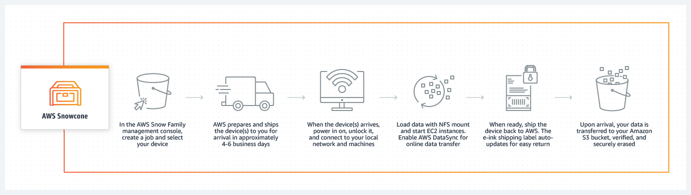
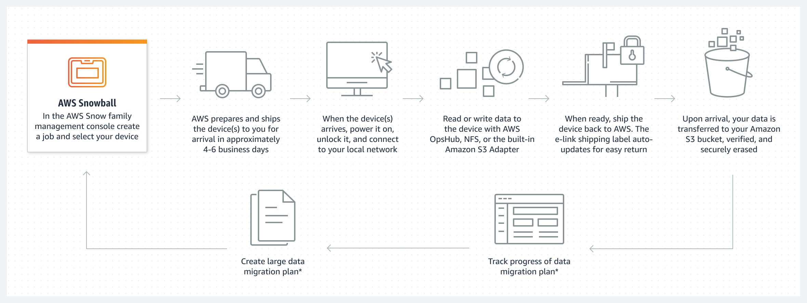
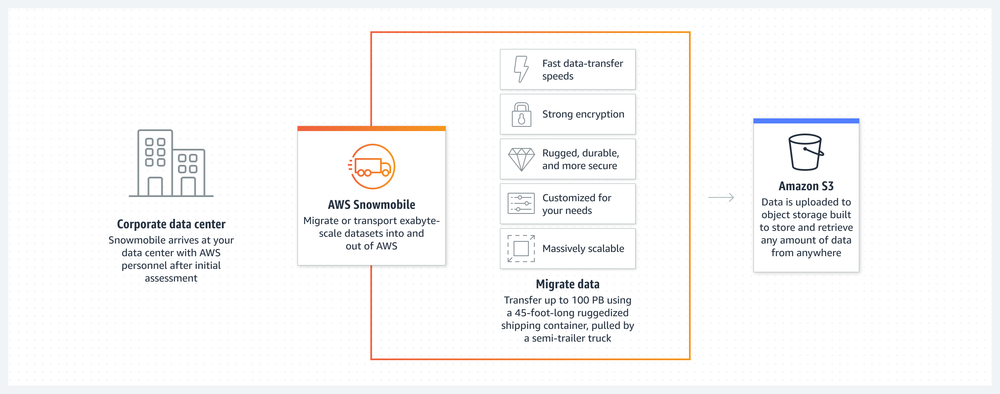

# [Snow Family](https://aws.amazon.com/de/snow/?nc2=type_a)

## Überblick:
Die AWS Snow Family representiert hoch-sichere, portable Geräte zum Sammeln und prozessieren von Daten.

### 1) Entweder "at the edge" (am Rande) oder,

### 2) zum migrieren in und aus AWS.

## Datenmigration:

### 1) Snowcone (Du trägst selbst Sorge um deine eigenen Batterien und Kabel ; )

A) Snowcone - 8 TB HDD

B) Snowcone SSD - 14 TB SSD

* Kompakt und leicht:

Snowcone ist kompakt und leicht, was den Transport und Einsatz in verschiedenen Umgebungen erleichtert. Es ist etwa so groß wie ein kleiner Kühler und wiegt nur wenige Kilogramm.

* Robustes Design:

Das Gerät ist robust gebaut, um widrigen Bedingungen standzuhalten, was es ideal für den Einsatz in abgelegenen oder anspruchsvollen Umgebungen macht.

* Datentransfer und Verarbeitung vor Ort:

Snowcone ermöglicht nicht nur den sicheren Transport von Daten in die AWS-Cloud, sondern bietet auch die Möglichkeit, Daten vor Ort zu verarbeiten. Dies kann besonders nützlich sein, wenn schnelle lokale Verarbeitung erforderlich ist, bevor die Daten in die Cloud übertragen werden.

* Integrierte Sicherheit:

Wie andere Mitglieder der AWS Snow-Familie ist Snowcone darauf ausgerichtet, sicherheitsrelevante Anforderungen zu erfüllen. Die Daten werden während des Transports verschlüsselt, und das Gerät selbst ist so konzipiert, dass es physisch sicher ist.

* Vielseitige Anwendungen:

Snowcone eignet sich für verschiedene Anwendungsfälle, darunter das Sammeln und Übertragen von IoT-Daten, das Sichern von Daten in entfernten Standorten oder das Durchführen von Edge-Computing-Anwendungen.

* Einfache Nutzung:

AWS Snowcone wird in Verbindung mit den AWS Snowball-Diensten verwendet, um den einfachen und sicheren Transfer von Daten in die AWS-Cloud zu ermöglichen. Kunden können das Gerät bestellen, ihre Daten darauf übertragen und es dann an AWS zurücksenden, wo die Daten in die entsprechenden AWS-Services integriert werden.

AWS Snowcone ist somit eine Lösung für den Datentransfer in Umgebungen mit begrenztem Platz und speziellen Anforderungen, die dennoch eine robuste und sichere Datenübertragung in die Cloud erfordern.

### 2) Snowball Edge

A) Snowball Edge - speicheroptimiert: 80 TB HDD Kapazität

B) Snowball Edge - rechenoptimiert: 42 TB HDD oder 28 TB NVMe Kapazität

* Datenübertragung:
  
Snowball Edge ermöglicht es Kunden, große Mengen an Daten physisch auf das Gerät zu übertragen. Dies ist besonders nützlich in Umgebungen, in denen der Upload großer Datenmengen über das Internet unpraktisch oder zeitaufwändig ist.

* Integrierte Rechenleistung:
  
Snowball Edge verfügt über eingebaute Rechenleistung in Form von AWS Lambda-Funktionen und bestimmten EC2-Instanztypen. Dies ermöglicht es, Anwendungen direkt auf dem Gerät auszuführen, ohne dass Daten zuerst in die Cloud übertragen werden müssen. Das ist besonders vorteilhaft für Edge-Computing-Szenarien, bei denen lokale Verarbeitung vor Ort erforderlich ist.

* Vielseitige Anwendungen:
  
Snowball Edge kann für verschiedene Anwendungsfälle eingesetzt werden, einschließlich Datenmigration, Datenverarbeitung vor Ort, IoT-Datenaggregation, lokale Speicherung und Bereitstellung von Anwendungen in abgelegenen Umgebungen.

* Robustes Design:
  
Das Gerät ist robust gebaut, um widrige Bedingungen standzuhalten, und es kann in Umgebungen mit schwierigen Bedingungen eingesetzt werden.

* Sicherheit:
  
Snowball Edge bietet integrierte Sicherheitsfunktionen, einschließlich Verschlüsselung während des Transports und physischer Sicherheitsmaßnahmen am Gerät selbst.

* Clusterbildung:
  
Mehrere Snowball Edge-Geräte können zu einem Cluster gruppiert werden, um die Rechenleistung und den Speicherbedarf zu erhöhen. Dies ermöglicht eine bessere Skalierbarkeit für anspruchsvollere Anwendungen.

* Verfügbarkeit von Amazon Services:
  
Snowball Edge bietet eine Auswahl von vorinstallierten AWS-Diensten, die direkt vor Ort auf dem Gerät genutzt werden können. Dies erleichtert die nahtlose Integration von Daten und Anwendungen in die AWS-Cloud.

* Unterstützung für Snowball Edge Storage Optimized:
  
Es gibt zwei Varianten von Snowball Edge - Standard und Storage Optimized. Die Storage-Optimized-Variante bietet zusätzlichen lokalen Speicherplatz und eignet sich besonders für anwendungsspezifische Workloads mit hohem Speicherbedarf.

AWS Snowball Edge ist somit eine leistungsstarke Lösung für den Datentransfer und die lokale Datenverarbeitung in Umgebungen mit begrenzter Konnektivität oder spezifischen Anforderungen an die Rechenleistung vor Ort.

### 3) Snowmobile

AWS Snowmobile ist eine extrem leistungsstarke und spezialisierte Lösung für den Transfer sehr großer Datenmengen in die AWS-Cloud. Im Wesentlichen handelt es sich dabei um einen physischen, hochsicheren Container in Form eines 45-Fuß-Lastwagens, der dafür entwickelt wurde, riesige Mengen an Daten aus einem lokalen Rechenzentrum direkt in die Cloud zu transportieren.

Hier sind die Hauptmerkmale und Funktionen von AWS Snowmobile:

!-- 1 Exabyte = 1.000 Petabyte = 1.000.000 Terabytes --!

* Exabyte-Scale Transfer:
  
Snowmobile wurde speziell für den Transport von Daten im Exabyte-Maßstab entwickelt. Es ist ideal für Unternehmen, die massive Datenmengen haben, die über herkömmliche Netzwerkverbindungen nicht effizient oder praktikabel übertragen werden können.

* 45-Fuß-Container:

Snowmobile kommt in Form eines speziell ausgestatteten 45-Fuß-Container-LKWs. Dieser Container ist mit umfangreichen Sicherheits- und Überwachungseinrichtungen ausgestattet, um sicherzustellen, dass die Daten während des gesamten Transportprozesses geschützt sind.

* Sicherheit und Schutz:

Der Snowmobile-Container ist stark gepanzert und mit mehreren Schutzmechanismen ausgestattet, um physische Sicherheit und Datenschutz zu gewährleisten. Der gesamte Transportprozess ist darauf ausgerichtet, sicher und vertraulich zu sein.

* Vor-Ort-Service:

Ein AWS-Team kommt mit dem Snowmobile-Container zum Standort des Kunden. Die Kunden können ihre Daten direkt vor Ort in den Container laden, ohne sie über das Internet übertragen zu müssen.

* Beschleunigter Datenzugriff:

Snowmobile bietet eine schnelle Übertragungsgeschwindigkeit, da die Daten direkt auf das physische Speichermedium im Container geladen werden. Dies ist besonders vorteilhaft für Organisationen mit enormen Datenmengen, die Zeit und Bandbreite sparen müssen.

* Integration mit AWS:

Nachdem der Snowmobile-Container mit den Daten beladen wurde, wird er sicher zum nächsten AWS-Rechenzentrum transportiert. Dort werden die Daten in die entsprechenden AWS-Services integriert und stehen dann in der Cloud zur Verfügung.

* Ideal für Datenzentren:

Snowmobile eignet sich besonders für Unternehmen mit großen Datenzentren, die eine umfassende Datenmigration in die Cloud planen oder ihre gesamte Dateninfrastruktur in die Cloud verlagern möchten.

* Planung und Koordination:

Die Nutzung von AWS Snowmobile erfordert eine sorgfältige Planung und Koordination zwischen dem Kunden und dem AWS-Team, um einen reibungslosen Datenübertragungsprozess zu gewährleisten.

AWS Snowmobile ist somit eine maßgeschneiderte Lösung für Unternehmen mit extremen Anforderungen an die Datenübertragung und bietet eine physische und sichere Möglichkeit, Daten im Exabyte-Maßstab in die AWS-Cloud zu bewegen.

Edge computing (Datenverarbeitung am Rande des Netzwerkes):

1) Snowcone

2) Snowball Edge

Aber warum wollen wir Daten mit der AWS Snow Family in oder aus AWS migrieren?

Wenn wir auf die Zeit in Betracht ziehen, die es braucht um Daten zu übertragen, dann kann die Übertragung verhältnismäßig zu viel Zeit in Anspruch nehmen. Deshalb stehen wir vor folgenden Herausforderungen:

* limitierte Konnektivität
* limitierte Bandbreite
* hohe Netzwerkkosten
* geteilte Bandbreiten (am Arbeitsplatz)
* Stabilität der Konnektivität

Alle diese Fälle begründen die Anwendung von Snow Family

Snowballs sind große physische Datenträger, die dazu verwendet werden, große Mengen an Daten in AWS zu migrieren. Es handelt sich um eine Daten-Transportlösung im Peta-Byte-Maßstab. Die Verwendung physischer Datenträger wie Snowballs hilft, gängige Probleme bei der Übertragung großer Datenmengen zu umgehen, wie hohe Netzwerkkosten, lange Übertragungszeiten und Sicherheitsbedenken. Snowballs sind von Design her äußerst sicher, und sobald der Datentransfer abgeschlossen ist, werden die Snowballs von deinen Daten bereinigt.

[AWS Snow Ball Dokumentation](https://aws.amazon.com/de/snowball/features/)

## Snowball Schlüsselinformationen:
Snowball ist eine gute Wahl für einen Datentransfer-Job, wenn du:
* eine sichere und schnelle Datenübertragung im Terabyte- bis Petabyte-Bereich in AWS benötigst.
Snowball kann auch die richtige Wahl sein, wenn du:
* keine teuren Upgrades an deiner bestehenden Netzwerkinfrastruktur vornehmen möchtest, wenn du:
* häufig große Datenrückstände hast, wenn du dich in einer physisch isolierten Umgebung befindest oder wenn du:
* in einer Region bist, in der Hochgeschwindigkeits-Internetverbindungen nicht verfügbar oder kostspielig sind.

### Als Faustregel gilt: 

* Wenn es länger als eine Woche dauert, um deine Daten mit der ungenutzten Kapazität deiner bestehenden Internetverbindung in AWS hochzuladen, solltest du in Betracht ziehen, Snowball zu verwenden.

Zum Beispiel, wenn du über eine 100 Mb-Verbindung verfügst, die du ausschließlich für die Übertragung deiner Daten verwenden kannst, und du insgesamt 100 TB Daten übertragen musst, wird die Übertragung über diese Verbindung mehr als 100 Tage dauern. Du kannst die gleiche Übertragung in etwa einer Woche mit mehreren Snowballs durchführen.
Hier ist eine Referenz dafür, wann Snowball in Betracht gezogen werden sollte, basierend auf der Anzahl der Tage, die für dieselbe Übertragung über eine Internetverbindung benötigt würden:

Snowball Edge und Snowmobile:

Snowball Edge ist eine spezielle Art von Snowball, die sowohl über Rechen- als auch über Speicherfunktionen über AWS Lambda und bestimmte EC2-Instanztypen verfügt. Das bedeutet, dass du Code in deinem Snowball ausführen kannst, während deine Daten auf dem Weg zu einem Amazon Rechenzentrum sind. Dies ermöglicht die Unterstützung von lokalen Workloads an abgelegenen oder offline befindlichen Standorten, und daher muss Snowball Edge nicht auf einen Datentransferservice beschränkt sein. Ein interessanter Anwendungsfall ist bei Flugzeugen. Flugzeuge fliegen manchmal mit Snowball Edges an Bord, damit sie große Mengen von Flugdaten speichern und die für die eigenen Systeme des Flugzeugs erforderlichen Funktionen berechnen können. Snowball Edges können auch lokal gruppiert werden, um eine noch bessere Leistung zu erzielen.
Snowmobile ist eine Daten-Transportlösung im Exabyte-Maßstab. Es handelt sich um eine Lösung für den Transport von 100 Petabyte Daten und befindet sich in einem 45 Fuß langen Frachtcontainer, der von einem Sattelschlepper gezogen wird. Diese massive Übertragung macht Sinn, wenn du dein gesamtes Rechenzentrum mit Jahren an Daten in die Cloud verschieben möchtest.

[Zurück zum Leitfaden](../../README.md)
