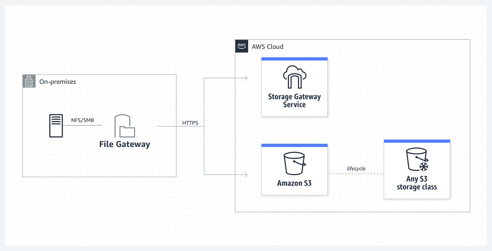
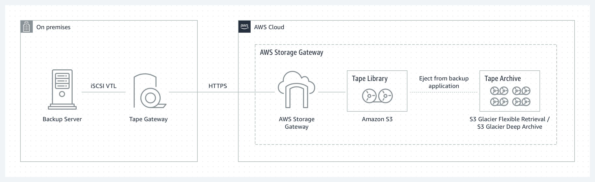

# [Storage Gateway](https://aws.amazon.com/de/storagegateway/features/?nc=sn&loc=2&dn=1) (Speicherzugang):

Das AWS- Storage Gateway ist ein Dienst, der lokale Umgebungen mit cloudbasiertem Speicher verbindet, um nahtlos und sicher eine lokale Anwendung mit einem cloudbasierten Speicher-Backend zu integrieren. Storage Gateways gibt es in drei Varianten: 

1. [File Gateway](https://docs.aws.amazon.com/de_de/filegateway/latest/files3/what-is-file-s3.html),

  2. [Volume Gateway](https://docs.aws.amazon.com/de_de/storagegateway/latest/vgw/WhatIsStorageGateway.html) und

  3. [Tape Gateway](https://docs.aws.amazon.com/de_de/storagegateway/latest/tgw/WhatIsStorageGateway.html):

Storage Gateway Schlüsseldetails:
Der Storage Gateway-Dienst kann entweder ein physisches Gerät oder ein VM-Image sein, das auf einem Host in einem lokalen Rechenzentrum installiert wird. Es fungiert als Brücke zum Senden oder Empfangen von Daten von AWS.
Storage Gateway kann auf dem VMWare ESXi-Hypervisor für Linux-Maschinen und dem Hyper-V-Hypervisor von Microsoft für Windows-Maschinen installiert werden.
Die drei Arten von Storage Gateways sind unten aufgeführt:
File Gateway - Funktioniert über NFS oder SMB und wird verwendet, um Dateien in S3 über einen Netzdateisystem-Mountpunkt in der bereitgestellten virtuellen Maschine zu speichern. Einfach ausgedrückt kannst du dir einen File Gateway als Dateisystem-Mountpunkt auf S3 vorstellen.
Volume Gateway - Funktioniert über iSCSI und wird verwendet, um Kopien von Festplatten oder virtuellen Festplatten in S3 zu speichern. Dies kann über Stored Volumes oder Cached Volumes erreicht werden. Einfach ausgedrückt kannst du dir Volume Gateway als eine Möglichkeit vorstellen, virtuelle Festplatten in der Cloud zu speichern.
Tape Gateway - Funktioniert als Virtual Tape Library
Relevante Dateiinformationen, die durch Storage Gateway gehen, wie Dateibesitz, Berechtigungen, Zeitstempel usw., werden als Metadaten für die Objekte gespeichert, zu denen sie gehören. Sobald diese Dateidetails in S3 gespeichert sind, können sie nativ verwaltet werden. Das bedeutet, dass alle S3-Funktionen wie Versionierung, Lebenszyklus-Management, Bucket-Richtlinien, Cross-Region-Replikation usw. als Teil von Storage Gateway angewendet werden können.
Die Anwendungen, die mit AWS über das Volume Gateway interagieren, geschehen über das iSCSI-Blockprotokoll. Daten, die auf diese Volumes geschrieben werden, können asynchron in AWS Elastic Block Store (EBS) als punktuelle Snapshots des Inhalts der Volumes gesichert werden. Diese Art von Snapshots fungiert als inkrementelle Backups, die nur den geänderten Zustand erfassen, ähnlich wie ein Pull-Antrag in Git. Alle Snapshots werden außerdem komprimiert, um die Speicherkosten zu reduzieren.
Tape Gateway bietet eine langlebige und kostengünstige Möglichkeit, Daten in S3 zu archivieren und zu replizieren, während gleichzeitig auf Bänder (alte Datenspeicherung) verzichtet wird. Die Virtual Tape Library oder VTL nutzt vorhandene bandbasierte Backup-Infrastrukturen, um Daten auf virtuellen Bandkassetten zu speichern, die du auf dem Tape Gateway erstellst. Es ist eine großartige Möglichkeit, Backups zu modernisieren und in die Cloud zu verschieben.
Stored Volumes vs. Cached Volumes:
Stored Volumes von Volume Gateway ermöglichen es dir, Daten lokal vor Ort zu speichern und die Daten als sekundäre Datenquelle in AWS zu sichern. Stored Volumes ermöglichen einen Zugriff mit geringer Latenz auf vollständige Datensätze und bieten gleichzeitig eine hohe Verfügbarkeit über eine hybride Cloud-Lösung. Du kannst Stored Volumes außerdem auf der Anwendungsinfrastruktur als iSCSI-Laufwerke einbinden, sodass beim Schreiben von Daten auf diese Volumes die Daten sowohl auf die lokale Hardware als auch asynchron als Snapshots in AWS EBS oder S3 geschrieben werden.

Im folgenden Diagramm einer Stored Volume-Architektur wird dem Benutzer Daten aus dem Storage Area Network, Network Attached oder Direct Attached Storage in deinem Rechenzentrum bereitgestellt. S3 existiert nur als sichere und zuverlässige Sicherung.
Screen Shot 2020-06-08 at 5 10 33 PM
Cached Volumes von Volume Gateway unterscheiden sich, da sie den gesamten Datensatz nicht lokal wie Stored Volumes speichern. Stattdessen wird AWS als primäre Datenquelle verwendet, und die lokale Hardware dient als Zwischenspeicherebene. Nur die am häufigsten verwendeten Komponenten werden auf der lokalen Infrastruktur behalten, während die verbleibenden Daten von AWS bereitgestellt werden. Dies minimiert die Notwendigkeit, die lokale Infrastruktur zu skalieren, während gleichzeitig der Zugriff mit geringer Latenz auf die am häufigsten referenzierten Daten beibehalten wird.

[Zurück zum Leitfaden](../../README.md)
