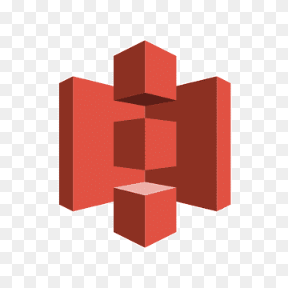

# s3 (S-imple S-torage S-ervice) 

Amazon **s3** wurde im Jahr 2006 von Amazon Web Services (AWS) eingeführt. Es war einer der ersten Dienste, die von AWS angeboten wurden und revolutionierte die Art und Weise, wie Daten in der Cloud gespeichert und abgerufen werden.

Amazon **s3** wird für eine Vielzahl von Anwendungsfällen benötigt, darunter die zuverlässige und skalierbare Speicherung von Daten in der Cloud. Es dient als zentraler Speicherort für verschiedene Arten von Daten, wie Dateien, Backups, Medieninhalte und Anwendungsdaten. Zusätzlich bietet S3 Funktionen für Datenarchivierung, Datenanalyse, Content Delivery und sichere Datenfreigabe, was es zu einer vielseitigen Lösung für Unternehmen jeder Größe und Branche macht.

**s3** bietet Entwicklern und IT-Teams eine 
* sichere,
* dauerhafte und
* hoch skalierbare Objektspeicherung.

*Objekt*speicherung, im Gegensatz zur *Block*speicherung, ist ein allgemeiner Begriff, der sich auf Daten bezieht, die aus drei Komponenten bestehen:

* die Daten, die du speichern möchtest
* eine erweiterbare Menge an Metadaten
* eine eindeutige Kennung, damit die Daten abgerufen werden können.

Dies macht **s3** zu einem idealen Kandidaten, um 
* **_Dateien oder Verzeichnisse_ zu hosten**,
* aber **_ungeeignet, um Datenbanken oder Betriebssysteme_ zu hosten**.

## Schlüsseldetails:

Objekte (normale Dateien oder Verzeichnisse) werden in **s3** mit 
* einem Schlüssel,
* einem Wert,
* einer Versions-ID und
* Metadaten gespeichert.

Sie können auch [Torrents](https://de.wikipedia.org/wiki/BitTorrent) und Unterrressourcen für Zugriffskontrolllisten enthalten, die im Grunde genommen Berechtigungen für das Objekt selbst sind.

Das [Datenkonsistenz](https://de.wikipedia.org/wiki/Konsistenz_(Datenspeicherung))modell für **s3** gewährleistet sofortigen Lesezugriff auf neue Objekte nach den ersten PUT-Anfragen. Diese neuen Objekte werden zum ersten Mal in AWS eingeführt und müssen daher an keiner anderen Stelle aktualisiert werden, sodass sie sofort verfügbar sind.

Das [Datenkonsistenz](https://de.wikipedia.org/wiki/Konsistenz_(Datenspeicherung))modell für **S3** gewährleistet auch sofortigen Lesezugriff für PUTS und LÖSCHUNGEN bereits vorhandener Objekte seit Dezember 2020.

Amazon garantiert eine Haltbarkeit von **99,999999999%** (oder **11 9en**) für alle **s3**-Speicherklassen, 
* außer der Klasse für reduzierte [Redundanz](https://de.wikipedia.org/wiki/Redundanz_(Informationstheorie)).

## Hauptfunktionen:
* gestaffelte Speicherung und variable Preisgestaltung
* Lebenszyklusverwaltung zur Löschung älterer Inhalte
* Versionierung für Versionskontrolle
* Verschlüsselung für Datenschutz
* MFA-Löschung zur Vermeidung versehentlicher oder bösartiger Entfernungen von Inhalten
* Zugriffskontrolllisten und Bucket-[Policies](https://awspolicygen.s3.amazonaws.com/policygen.html) zur Sicherung der Daten

## Gebühren für:
* Speichergröße
* Anzahl der Anfragen
* Preisgestaltung für die Speicherverwaltung (bekannt als Ebenen)
* Preisgestaltung für den Datentransfer (Objekte, die AWS über das Internet verlassen/betreten)
* Transferbeschleunigung (eine optionale Geschwindigkeitssteigerung für den Objekttransfer über [CloudFront](../../docs/services/CloudFront.md))
* Replikation über Regionen hinweg (höhere Verfügbarkeit als standardmäßig angeboten)

*Bucket-Policies sichern Daten auf der Bucket-Ebene, während Zugriffskontrolllisten Daten auf der granularen Objektebene sichern.*

Standardmäßig sind alle neu erstellten Buckets **privat**. Das heißt, das der **_Öffentlichkeitszugriff explizit angegeben, bzw. freigeschaltet_ werden muss**.

**s3** kann so konfiguriert werden, dass Zugriffsprotokolle erstellt werden, die *in einen anderen Bucket im aktuellen Konto oder sogar in ein separates Konto verschoben werden können.* Dadurch ist es einfach zu überwachen, wer auf welche Inhalte in **s3** zugreift.

## Es gibt **_drei verschiedene Möglichkeiten_, S3-Buckets über AWS-Konten hinweg freizugeben**:
* Für rein programmatischen Zugriff: -> IAM und Bucket-[Policies](https://awspolicygen.s3.amazonaws.com/policygen.html) verwenden, um ganze Buckets freizugeben.
* Für rein programmatischen Zugriff: -> ACLs und Bucket-[Policies](https://awspolicygen.s3.amazonaws.com/policygen.html) verwenden, um Objekte freizugeben.
* Für Zugriff über die Konsole und das Terminal: -> Cross-Account IAM-Rollen verwenden.

**s3** eignet sich hervorragend **für das Hosting statischer Websites**. Wenn du das statische Website-Hosting für S3 aktivierst, benötigst du sowohl 
* eine index.html-Datei als auch
* eine error.html-Datei.

Das Hosting statischer Websites erstellt einen Website-Endpunkt, der über das Internet aufgerufen werden kann.

Wenn du neue Dateien hochlädst und die Versionierung aktiviert ist, erben sie nicht die Eigenschaften der vorherigen Version.

# s3-Speicherklassen:

## s3 Standard:
* 99,99% Verfügbarkeit und 11 9en Haltbarkeit.

Daten dieser Klasse werden [redundant](https://de.wikipedia.org/wiki/Redundanz_(Informationstheorie)) auf mehreren Geräten in mehreren Einrichtungen gespeichert und sind so konzipiert, dass sie den Ausfall von 2 gleichzeitigen Rechenzentren überstehen können.

## s3 Infrequent Access (IA):
* Für Daten, die seltener benötigt werden,
* aber wenn sie benötigt werden, sollte der Zugriff **schnell** möglich sein.

Die Speicherungsgebühr ist günstiger, aber es fallen Kosten für den Abruf an.

## s3 One Zone Infrequent Access (eine Verbesserung der früheren RRS / Reduced Redundancy Storage):
* Wenn du die niedrigeren Kosten von IA möchtest, aber keine hohe Verfügbarkeit benötigst.
* Dies ist noch günstiger aufgrund des fehlenden Hochverfügbarkeitsmechanismus.

## s3 Intelligent Tiering:
* Verwendet eingebaute ML/AI, um die kosteneffektivste Speicherkategorie zu bestimmen und deine Daten automatisch in die entsprechende Ebene zu verschieben. * Dies geschieht ohne betrieblichen Overhead oder Leistungseinbußen.

## s3 Glacier:
* eine kostengünstige Speicherkategorie für Datenarchivierung.
* Diese Klasse dient ausschließlich dem Speichern von Daten, bei denen Abrufungen nicht häufig erforderlich sind.
* Die Abrufzeiten liegen zwischen Minuten und Stunden.
* Es gibt unterschiedliche Abrufmethoden, je nachdem, wie akzeptabel die Standard-Abrufzeiten für dich sind:

### Expedited: 
* 1-5 Minuten, aber diese Option ist die teuerste.
### Standard:
* 3-5 Stunden zur Wiederherstellung.
### Bulk: 
* 5-12 Stunden.

Diese Option hat die geringsten Kosten und eignet sich für große Datenmengen.

Die oben genannte Dauer für Expedited kann in seltenen Fällen außergewöhnlich hoher Nachfrage in allen AWS-Bereichen länger sein. Wenn ein schneller Zugriff auf deine Glacier-Daten unter allen Umständen unbedingt erforderlich ist, musst du Kapazitäten bereitstellen. Kapazitäten bereitstellen garantiert, dass Expedited-Abrufungen immer innerhalb der Zeitgrenzen von 1 bis 5 Minuten funktionieren.

## S3 Deep Glacier:
* Der kostengünstigste S3-Speicher, bei dem der Abruf 12 Stunden dauern kann.

3-Verschlüsselung:
S3-Daten können sowohl während der Übertragung als auch im Ruhezustand verschlüsselt werden.

Verschlüsselung während der Übertragung: Der Datenverkehr zwischen den Endpunkten wird undurchsichtig gemacht, sodass niemand, der den Datenverkehr abfängt, die Informationen verstehen kann. Die Verschlüsselung während der Übertragung für S3 wird immer mit SSL/TLS erreicht.

Verschlüsselung im Ruhezustand: Die ruhenden Daten innerhalb von S3 werden verschlüsselt. Selbst wenn jemand in einen Server eindringt, kann er nicht auf die verschlüsselten Informationen in diesem Server zugreifen. Die Verschlüsselung im Ruhezustand kann entweder serverseitig oder clientseitig erfolgen. Die serverseitige Verschlüsselung erfolgt, wenn S3 Ihre Daten verschlüsselt, während sie auf die Festplatte geschrieben werden, und sie beim Zugriff entschlüsselt. Die clientseitige Verschlüsselung erfolgt, wenn Sie das Objekt persönlich verschlüsseln und es anschließend in S3 hochladen.

Sie können die Verschlüsselung auf der serverseitigen AWS-Seite auf folgende Weise durchführen:

S3 Managed Keys / SSE - S3 (Server-seitige Verschlüsselung S3): Amazon verwaltet automatisch die Verschlüsselungs- und Entschlüsselungsschlüssel für Sie. In diesem Szenario geben Sie etwas Kontrolle an Amazon ab, erhalten jedoch eine einfache Nutzung.
AWS Key Management Service / SSE - KMS: Amazon und Sie verwalten gemeinsam die Verschlüsselungs- und Entschlüsselungsschlüssel.
Serverseitige Verschlüsselung mit kundeneigenen Schlüsseln / SSE - C: Sie geben Amazon Ihre eigenen Schlüssel, die Sie verwalten. In diesem Szenario geben Sie die einfache Nutzung zugunsten einer höheren Kontrolle auf.

S3-Versionierung:
Wenn die Versionierung aktiviert ist, speichert S3 alle Versionen eines Objekts, einschließlich aller Schreib- und sogar Löschvorgänge.
Dies ist eine großartige Funktion für die implizite Sicherung von Inhalten und für einfache Rollbacks im Falle von menschlichen Fehlern.
Man kann es als analog zu Git betrachten.
Sobald die Versionierung für einen Bucket aktiviert ist, kann sie nicht deaktiviert, sondern nur ausgesetzt werden.
Die Versionierung integriert sich mit Lifecycle-Regeln, sodass Sie Regeln festlegen können, um Daten basierend auf ihrer Version zu löschen oder zu migrieren.
Die Versionierung verfügt auch über die MFA-Löschfunktion, um eine zusätzliche Sicherheitsebene zu bieten.

S3 Lifecycle-Management:
Automatisiert das Verschieben von Objekten zwischen den verschiedenen Speichertiers.
Kann in Verbindung mit der Versionierung verwendet werden.
Lifecycle-Regeln können sowohl auf aktuelle als auch auf frühere Versionen eines Objekts angewendet werden.

S3 Cross Region Replikation:
Die Cross-Region-Replikation funktioniert nur, wenn die Versionierung aktiviert ist.
Wenn die Cross-Region-Replikation aktiviert ist, wird keine bereits vorhandene Daten übertragen. Nur neue Uploads in den ursprünglichen Bucket werden repliziert. Alle nachfolgenden Aktualisierungen werden ebenfalls repliziert.
Wenn Sie den Inhalt eines Buckets in einen anderen replizieren, können Sie tatsächlich den Besitz des Inhalts ändern, wenn Sie dies wünschen. Sie können auch die Speicherebene des neuen Buckets mit dem replizierten Inhalt ändern.
Wenn Dateien im ursprünglichen Bucket gelöscht werden (über ein Löschkennzeichen, da die Versionierung echte Löschungen verhindert), werden diese Löschvorgänge nicht repliziert.

S3 Transfer Acceleration:
Transfer Acceleration nutzt das CloudFront-Netzwerk, um Daten an den Randstandorten des CDN (Content Delivery Network) zu senden oder von dort zu empfangen, anstatt langsamere Uploads oder Downloads am Ursprungsort durchzuführen.
Dies wird erreicht, indem Sie eine separate URL für den Randstandort verwenden, anstatt den Bucket selbst zu verwenden. Die Daten werden dann über das AWS-Netzwerkrückgrat mit einer viel höheren Geschwindigkeit übertragen.
Sie können die Geschwindigkeit der Übertragungsbeschleunigung direkt im Vergleich zu regulären Uploads testen.

S3-Ereignisbenachrichtigungen:
Die Amazon S3-Benachrichtigungsfunktion ermöglicht es Ihnen, Benachrichtigungen zu empfangen und zu senden, wenn bestimmte Ereignisse in Ihrem Bucket auftreten. Um Benachrichtigungen zu aktivieren, müssen Sie zunächst die Ereignisse konfigurieren, die Amazon S3 veröffentlichen soll (neues Objekt hinzugefügt, altes Objekt gelöscht usw.) und die Ziele festlegen, an die Amazon S3 die Ereignisbenachrichtigungen senden soll. Amazon S3 unterstützt die folgenden Ziele, an die Ereignisse veröffentlicht werden können:

Amazon Simple Notification Service (Amazon SNS): Ein Webdienst, der die Koordination und Verwaltung der Zustellung oder des Sendens von Nachrichten an abonnierende Endpunkte oder Clients ermöglicht.
Amazon Simple Queue Service (Amazon SQS): SQS bietet zuverlässige und skalierbare gehostete Warteschlangen zum Speichern von Nachrichten während ihrer Übertragung zwischen Computern.
AWS Lambda: AWS Lambda ist ein Bereitstellungsservice, bei dem Sie Ihren Code hochladen und der Service den Code in Ihrem Auftrag mithilfe der AWS-Infrastruktur ausführen kann. Wenn Sie eine Lambda-Funktion erstellen, verpacken und laden Sie Ihren benutzerdefinierten Code in AWS Lambda hoch. Das S3-Ereignis, das die Lambda-Funktion auslöst, kann auch als Eingabe für den Code dienen.

[Zurück zum Leitfaden](../../README.md)
